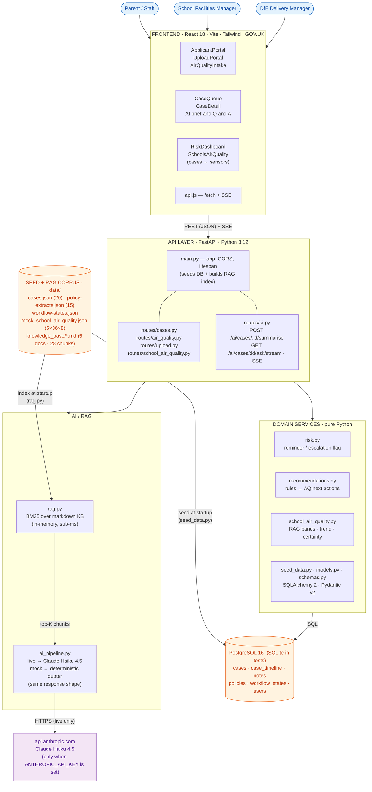
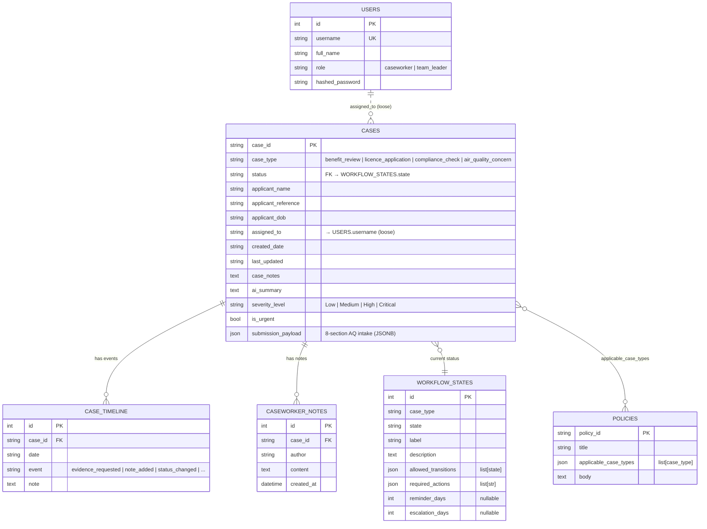

# School Air Quality Tracker

A platform for monitoring, reporting, and managing air quality concerns in UK schools — combining crowdsourced case reports from parents and staff with administrative sensor data from SAMHE-compatible monitors.

Built as a prototype for the **Version 1 AI Engineering Lab Hackathon, April 2026**.

## Problem

Poor air quality in school buildings — mould, inadequate ventilation, high CO₂, chemical smells — has a measurable impact on pupil health and learning outcomes. But there is no joined-up system for:

- **Parents and staff** to report concerns and track what's being done
- **School facilities managers** to triage, assign, and resolve cases
- **DfE School Delivery Managers** to spot patterns across their portfolio and evidence funding needs

Information is scattered across email inboxes, maintenance logs, and sensor dashboards with no connection between them.

---

## Solution

### Architecture snapshot (read this first)

GitHub renders the Mermaid diagram below as a real flow chart. Every box maps to a real file or folder so you can navigate straight from this picture into the code.



If your viewer doesn't render Mermaid, the same picture in one paragraph:

> **Personas** (parents/staff · facilities · DfE) hit the **Frontend** (React+Vite, GOV.UK) which calls the **API** (FastAPI) over REST + SSE. The API splits two ways: **Domain services** (`risk`, `recommendations`, `school_air_quality`, `models`, `schemas`) read/write **Postgres**; the **AI/RAG** path runs `rag.py` (BM25 over markdown KB) and `ai_pipeline.py` (live → Claude Haiku 4.5, mock → deterministic quoter). At lifespan startup, `data/` JSON seeds Postgres and `data/knowledge_base/*.md` is indexed into BM25.

**Two invariants worth remembering:**
1. **The AI path is dual-mode.** Both branches return the same response shape with the same `chunks` array — the UI cannot tell live from mock except via the badge at `/`. This is what makes the demo work offline.
2. **Seed data is the source of truth at boot.** The Postgres tables are derived from `data/*.json` on lifespan startup; `knowledge_base/*.md` is loaded into an in-memory BM25 index. To reset, drop the Docker volume and restart.

### Three user surfaces

1. **Reporting Portal** — parents, teachers, and students submit air quality concern cases with evidence.
2. **Caseworker View** — school facilities managers see all open cases with timelines, workflow states, and required actions.
3. **Portfolio Dashboard** — DfE Delivery Managers view aggregated risk, trends, and unresolved issues across schools.

### AI layer

Optional AI assistant (Claude or deterministic mock mode) can:

- Summarise complex case histories
- Recommend next actions
- Compare against policies and thresholds
- Answer natural-language questions about cases, with `[KB-N]` citations to the underlying guidance

Retrieval is BM25 over a curated knowledge base (BB101, WHO AQG 2021, CIBSE TM21, HSE COSHH, SAMHE) — runs in both live and mock modes, so the demo works fully offline.

---

## Data models

Postgres holds six tables. A case fans out to timeline events and free-text notes; policies and workflow states are reference tables joined by `case_type`; users are isolated. Two extra entities (KB document, KB chunk) live in memory for the RAG layer and are not persisted.

### Entity relationship



### In-memory RAG entities

| Entity | Source | Key fields |
|--------|--------|------------|
| **KB Document** | YAML frontmatter in `data/knowledge_base/*.md` | `doc_id`, `title`, `publisher`, `year`, `url` |
| **KB Chunk** | Markdown sections (`##` heading boundaries) | `chunk_id`, `doc_id`, `heading`, `text`, BM25 token vector |

Both are rebuilt from disk every time the FastAPI app boots (`rag.py` runs in the lifespan handler).

### `submission_payload` shape (air_quality_concern)

JSONB field on `cases`. Captures the 8-section AQ intake without polluting the table schema. `severity_level` and `is_urgent` are duplicated as top-level columns so the dashboard / risk queries don't need JSON path operators.

```jsonc
{
  "submitter":    { "name": "...", "role": "parent | teacher | student | staff", "contact": "..." },
  "location":     { "school_name": "...", "school_urn": "138422", "room": "..." },
  "incident":     { "type": "mould | chemical | ventilation | pollutant | other",
                    "first_noticed": "2026-04-12", "ongoing": true },
  "exposure":     { "people_affected": 8, "vulnerable_groups": ["asthmatic"], "duration_hours": 4 },
  "observations": { "smell": "...", "visible": "...", "symptoms": ["headache", "cough"] },
  "severity":     { "level": "Critical", "urgency_flag": true },
  "history":      { "prior_reports": ["CASE-2026-00301"], "recurrence_count": 3 },
  "attachments":  [{ "filename": "...", "content_type": "...", "size_bytes": 0 }]
}
```

### Workflow state machine

Defined in `data/workflow-states.json`, loaded into `workflow_states` at startup. Per-type reminder/escalation thresholds drive `risk.py`:

| Case type | Reminder | Escalation |
|-----------|----------|------------|
| `benefit_review` | 28 d | 56 d |
| `licence_application` | 21 d | 42 d |
| `compliance_check` | 14 d | 28 d |
| **`air_quality_concern`** | **3 d** | **7 d** |

Shared lifecycle: `case_created → awaiting_evidence → under_review → pending_decision → closed`, with `escalated` as a branch. `allowed_transitions` and `required_actions` are per-type.

### Sensor dataset shape (`mock_school_air_quality.json`)

```jsonc
{
  "schools": [
    {
      "urn": "138422",
      "name": "Greenfield Primary",
      "region": "South West",
      "readings": [
        {
          "month": "2024-01",
          "co2_ppm": 1200, "pm25_ugm3": 14, "pm10_ugm3": 22,
          "no2_ugm3": 35,  "tvoc_ugm3": 410,
          "temperature_c": 19.2, "humidity_pct": 58,
          "occupancy_pct": 92
        }
        // ...36 months
      ]
    }
    // ...5 schools
  ]
}
```

Threshold authority and RAG band cutoffs live in `data/DATA_SPEC.md` (CIBSE TM21 / BB101, WHO AQG 2021, UK NAQS).

---

## Key features

### Crowdsourced case management
- Community reporting by parents, teachers, and students
- Case lifecycle: `case_created → awaiting_evidence → under_review → pending_decision → closed` (with `escalated` branch)
- Evidence attachments (photos, medical reports, maintenance records)
- Automatic flagging when a location has prior reports

### Administrative sensor data

SAMHE-compatible monthly readings:

- CO₂
- PM2.5 / PM10
- NO₂
- TVOC
- Temperature / humidity

Capabilities:

- Threshold scoring against CIBSE / WHO / UK NAQS guidance
- Seasonal trend analysis
- School-term context awareness
- Cross-reference with reported cases from the same school

### DfE portfolio view
- Aggregated case volumes by school, severity, and region
- Sensor trend summaries across schools
- Risk flagging for persistent poor readings
- Escalation visibility for unresolved serious cases

---

## Technology stack

- **Backend:** FastAPI + PostgreSQL 16 (SQLite in tests)
- **Frontend:** React 18 + Vite + Tailwind CSS (GOV.UK design language)
- **AI:** Claude API (Haiku 4.5) with deterministic fallback
- **Retrieval:** BM25 (`rank-bm25`) over markdown knowledge base
- **Infrastructure:** Docker Compose

---

## Quick start (Docker — recommended)

```bash
cp .env.example .env          # optional — add ANTHROPIC_API_KEY for live AI
docker compose up --build

# Frontend:  http://localhost:3000
# API docs:  http://localhost:8000/docs
# Root:      http://localhost:8000/   (shows ai_mode: live | mocked)
```

On startup the backend logs `[rag] indexed 28 knowledge-base chunks` once the corpus is loaded. If you don't see this line, retrieval will be empty.

### Reset the database

```bash
docker compose down -v        # nukes the postgres volume
docker compose up --build     # re-seeds from data/*.json on next boot
```

---

## Local development (without Docker)

Useful for backend hot-reload and breakpoint debugging.

### Backend

```bash
cd backend
python -m venv .venv && source .venv/bin/activate
pip install -r requirements.txt -r requirements-dev.txt

# Point at a local Postgres or use SQLite for quick iteration
export DATABASE_URL=sqlite:///./dev.db
export KB_DIR=$(pwd)/../data/knowledge_base
export ALLOWED_ORIGINS=http://localhost:5173,http://localhost:3000

uvicorn main:app --reload --port 8000
```

### Frontend

```bash
cd frontend
npm install
VITE_API_URL=http://localhost:8000 npm run dev   # served on :5173 in dev
```

### Tests

```bash
cd backend && pytest -q                      # 113 tests, runs against SQLite
pytest -q tests/test_rag.py -k bm25 -v       # target a specific area
pytest --cov=. --cov-report=term-missing     # coverage
```

---

## API reference

Base URL: `http://localhost:8000`. Full interactive docs at `/docs` (Swagger) and `/redoc`.

| Method | Path | Purpose |
|--------|------|---------|
| `GET`  | `/` | Health + `ai_mode: live \| mocked` |
| `GET`  | `/cases` | List cases (filter by `case_type`, `status`, `assigned_to`) |
| `GET`  | `/cases/{case_id}` | Case detail: timeline, workflow, matched policy, risk |
| `POST` | `/cases/{case_id}/notes` | Add caseworker note |
| `GET`  | `/cases/dashboard/risk` | Portfolio dashboard (escalation/reminder + AQ slice) |
| `GET`  | `/cases/by-reference/{reference}` | Applicant self-service status lookup |
| `GET`  | `/cases/{case_id}/recommended-actions` | Rules-engine output for AQ cases |
| `GET`  | `/cases/workflow/{case_type}` | State machine for a case type |
| `GET`  | `/cases/policies/` | All policy extracts |
| `POST` | `/cases/air-quality` | 8-section AQ concern intake |
| `POST` | `/upload/submit` | Generic case intake (legacy 3 case types) |
| `GET`  | `/air-quality/schools` | Sensor dashboard (5 schools, summary metrics) |
| `GET`  | `/air-quality/schools/{urn}` | Per-school sensor detail (RAG / trend / certainty / sources) |
| `POST` | `/ai/cases/{case_id}/summarise` | RAG-grounded brief with `[KB-N]` citations |
| `GET`  | `/ai/cases/{case_id}/ask/stream?q=...` | SSE-streamed Q&A grounded in KB |

### Curl examples

```bash
# Risk dashboard (used by team leader / DfE Delivery Manager)
curl -s http://localhost:8000/cases/dashboard/risk | jq

# AI brief on the chemical-spill demo case
curl -s -X POST http://localhost:8000/ai/cases/CASE-2026-00401/summarise | jq

# Streaming Q&A (Ctrl-C to stop)
curl -N "http://localhost:8000/ai/cases/CASE-2026-00401/ask/stream?q=What%20is%20the%20immediate%20response%3F"

# Per-school sensor detail
curl -s http://localhost:8000/air-quality/schools/138422 | jq '.measures[] | {name, rag, pct_of_threshold, trend}'
```

---

## How an AI request flows

```
 user question                                                       
      │                                                              
      ▼                                                              
 routes/ai.py                                                        
      │  fetch case + timeline + workflow + matched policy           
      ▼                                                              
 rag.py  ── BM25 search over knowledge_base/*.md ──► top-K chunks    
      │                                                              
      ▼                                                              
 ai_pipeline.py                                                      
   ├─ live   → Claude Haiku 4.5  (system prompt + case + chunks)     
   └─ mock   → deterministic generator quotes top-1 chunk verbatim   
      │                                                              
      ▼                                                              
 SSE stream → frontend renders text + [KB-N] pills + Sources panel   
```

Both modes return the same `chunks` array, so the UI is identical whether or not `ANTHROPIC_API_KEY` is set.

---

## Demo cases

| Case | Status | What's interesting |
|------|--------|--------------------|
| `CASE-2026-00401` | escalated | **Critical + URGENT** — chemical spill in school prep room |
| `CASE-2026-00402` | awaiting_evidence | **High** — mould in primary classroom with asthmatic pupils |
| `CASE-2026-00406` | escalated | **High + URGENT** — recurring mould, 3rd in 12 months |
| `CASE-2026-00409` | case_created | **Critical + URGENT** — just-submitted cleaning-product incident |

Open `CASE-2026-00401`, click **AI brief**, ask *"What's the immediate response for chemical exposure affecting 8 pupils?"* — answer streams with inline `[KB-N]` pills and a Sources panel.

---

## Mock users (password: `demo123`)

| Username | Role | Sees |
|----------|------|------|
| `j.patel` | Caseworker | team_a cases |
| `r.singh` | Caseworker | team_b cases |
| `m.khan` | Team leader / Delivery Manager | All teams (use this for the portfolio dashboard) |

---

## Repository structure

```
school-air-quality-tracker/
│
├── docker-compose.yml         # Backend + frontend + PostgreSQL
├── CLAUDE.md                  # AI agent context & conventions
│
├── backend/
│   ├── main.py                # FastAPI entrypoint
│   ├── models.py              # SQLAlchemy models
│   ├── schemas.py             # Pydantic schemas
│   ├── risk.py                # Risk scoring engine
│   ├── recommendations.py     # Rules-based actions
│   ├── school_air_quality.py  # Sensor data loader (RAG bands, trend, certainty)
│   ├── rag.py                 # BM25 retriever over knowledge base
│   ├── ai_pipeline.py         # Claude + deterministic mock layer
│   ├── seed_data.py           # Loads cases / policies / workflow states
│   └── routes/
│       ├── cases.py           # CRUD, detail, portfolio dashboard
│       ├── ai.py              # /summarise, /ask/stream (SSE)
│       ├── upload.py          # Generic intake
│       ├── air_quality.py     # 8-section AQ intake
│       └── school_air_quality.py  # Sensor dashboard endpoints
│
├── frontend/
│   ├── index.html
│   ├── vite.config.js
│   ├── tailwind.config.js
│   └── src/
│       ├── App.jsx            # GOV.UK layout, nav, AI-mode badge
│       ├── api.js             # fetch + SSE wrapper
│       └── components/
│           ├── ApplicantPortal.jsx     # Parent / staff status lookup
│           ├── UploadPortal.jsx        # Generic intake
│           ├── AirQualityIntake.jsx    # 8-section AQ report form
│           ├── CaseQueue.jsx           # Filterable list (risk pill + severity chip)
│           ├── CaseDetail.jsx          # Timeline · workflow · policy · AI brief + Q&A
│           ├── RiskDashboard.jsx       # Portfolio view (escalation/reminder + AQ slice)
│           └── SchoolsAirQuality.jsx   # Sensor dashboard, cross-linked to cases
│
└── data/
    ├── cases.json                       # 20 synthetic cases (10 legacy + 10 AQ)
    ├── policy-extracts.json             # 15 policy extracts
    ├── workflow-states.json             # State machines per case type
    ├── mock_school_air_quality.json     # 5 schools × 36 months × 8 measures
    ├── DATA_SPEC.md                     # Threshold authority (CIBSE / WHO / UK NAQS)
    └── knowledge_base/                  # RAG corpus (5 markdown docs, 28 chunks)
```

---

## Tests

```bash
docker compose exec backend pytest -q
# 113 passed
```

Coverage: risk thresholds, AQ intake, recommendations, sensor RAG bands / trend / certainty, BM25 retrieval, AI mock mode (with and without KB chunks), case routes, applicant lookup, generic upload.

---

## Key environment variables

| Variable | Purpose | Default |
|----------|---------|---------|
| `ANTHROPIC_API_KEY` | Optional. Unset → deterministic mock AI mode | (unset) |
| `DATABASE_URL` | Postgres connection string | auto-set by docker-compose |
| `PUBLIC_HOST` | Hostname/IP the browser uses (VM deploys) | `localhost` |
| `ALLOWED_ORIGINS` | Comma-separated CORS allow-list | localhost variants |
| `KB_DIR` | Path to RAG knowledge base | `/app/data/knowledge_base` |

See `.env.example` for the canonical list.

---

## What's real vs. mocked

| Component | Status |
|-----------|--------|
| Case data, timeline, policy matching, workflow state machine | **Real** — Postgres + seeded JSON |
| Risk thresholds, recommendations engine | **Real** — pure Python, deterministic |
| RAG retrieval (BM25 over knowledge base) | **Real** — runs in both AI modes |
| Sensor data | **Synthetic** — `mock_school_air_quality.json`, SAMHE-shaped |
| AI brief + Q&A | **Mocked by default**, live with `ANTHROPIC_API_KEY` |
| All applicant / school / pupil PII | **Synthetic** — no real personal data anywhere |

---

## Extending the app

### Add a knowledge-base document

1. Drop a markdown file into `data/knowledge_base/` with this frontmatter:
   ```markdown
   ---
   doc_id: my-new-guidance
   title: My New Guidance Document
   publisher: Some Authority
   year: 2026
   url: https://example.gov.uk/guidance
   ---

   ## Section heading
   Body chunk 1...

   ## Another section
   Body chunk 2...
   ```
2. Restart the backend — chunks are indexed at lifespan startup. Confirm with the `[rag] indexed N chunks` log line.
3. Optional: add a row to the KB table in `docs/RAG_ARCHITECTURE.md` so reviewers see provenance.

### Add a new case type

Use the scaffold:

```bash
.claude/commands/add-case-type.md   # /add-case-type NAME (run via Claude)
```

Or manually:
1. Append to `data/workflow-states.json` (states, `required_actions`, `allowed_transitions`, `reminder_days`, `escalation_days`).
2. Add a route in `backend/routes/` if the intake form has bespoke fields.
3. Extend `backend/recommendations.py` if you want rules-based suggested actions.
4. Add a frontend component under `frontend/src/components/` and wire it into `App.jsx` nav.
5. Add tests under `backend/tests/`.

### Add a sensor measure

1. Update `data/DATA_SPEC.md` with the threshold authority and bands.
2. Extend the loader in `backend/school_air_quality.py` (RAG bands, % of threshold, trend, certainty helpers).
3. Add the measure to `data/mock_school_air_quality.json` for all 5 schools × 36 months.
4. Update `SchoolsAirQuality.jsx` table headers if needed.

### Slash commands (Claude-driven)

`.claude/commands/` ships:

- `/generate-cases N` — generate N more synthetic cases
- `/add-case-type NAME` — scaffold a new case type end-to-end
- `/demo-check` — pre-demo sanity pass
- `/seed-reset` — wipe and re-seed the database

---

## Troubleshooting

| Symptom | Likely cause | Fix |
|---------|--------------|-----|
| Frontend shows `ai_mode: mocked` but you set `ANTHROPIC_API_KEY` | Var not exported into the backend container | Check `.env` is in the project root; `docker compose config` to verify |
| `[rag] indexed 0 knowledge-base chunks` | `KB_DIR` wrong or markdown frontmatter malformed | Confirm path; YAML frontmatter must start at line 1 with `---` |
| `psycopg2.OperationalError: could not connect` on local dev | Postgres not running, or `DATABASE_URL` points at Docker host | Use `sqlite:///./dev.db` for quick iteration |
| Stream response is blank | Browser/extension stripping `text/event-stream` | Try the curl example above to isolate; check network tab for SSE frames |
| CORS error in browser | `ALLOWED_ORIGINS` doesn't include your frontend URL | Add `http://localhost:5173` (Vite dev) to the env var |
| `pytest` fails on import | Virtualenv not activated | `source backend/.venv/bin/activate` |

---

## Why this matters

This prototype shows how government services can move from fragmented reporting and reactive maintenance to a joined-up, evidence-led case management platform that improves:

- **Student wellbeing** — early action on indoor-air-quality risks that affect health and learning outcomes
- **Operational response times** — caseworkers see everything they need on one screen, with policy and risk pre-computed
- **Transparency for parents and staff** — applicant portal and sensor dashboard surface real status, not just a ticket number
- **Smarter funding decisions** — DfE Delivery Managers can evidence patterns across their portfolio, not anecdote
- **Early intervention** — risk thresholds and recurrence flags catch issues before they escalate

---

## Future enhancements

| Theme | Item | What it unlocks |
|-------|------|-----------------|
| Sensors | **Live IoT sensor streaming** (MQTT / time-series ingest replacing JSON snapshot) | Real-time alerts; minute-level data for incident review |
| Spatial | **GIS map of school risks** (Leaflet / Mapbox over school URNs) | Pattern detection by region, ward, or local authority |
| Workflow | **Automated escalation workflows** (rule-driven state transitions) | Less manual triage, fully audit-friendly handoffs |
| Comms | **Email / Microsoft Teams / SMS notifications** with per-stakeholder templates | Closes the loop with applicants and assignees without manual chasing |
| Mobile | **Mobile reporting app** (PWA or native iOS/Android) | On-site capture with photo + GPS; parent-friendly status checks |
| ML | **Predictive risk modelling** (XGBoost / time-series) over case + sensor history | Forecast which schools will breach thresholds next term |
| Integration | **Multi-agency collaboration workflows** (DfE ↔ NHS ↔ HSE ↔ local authority) | Joint cases, shared evidence, cross-portfolio reporting |
| Auth | OAuth / SSO with role-aware row-level access | Production-grade per-team data isolation |
| RAG | Persistent vector store (`pgvector` / Chroma) + hybrid lexical+semantic search | Larger KB, better recall on synonym-heavy queries |
| Ops | Structured logging + metrics + tracing (OpenTelemetry, Prometheus, Grafana) | SLO-driven operations, incident replay |
| Data | Data lineage + retention policy for case attachments | GDPR-aligned operations and FOIA response |

---

## Documentation

| Doc | Read for |
|-----|----------|
| `docs/CONTEXT.md` | Full app context snapshot |
| `docs/RAG_ARCHITECTURE.md` | RAG data model, governance, demo Q&A |
| `docs/DEPLOYMENT.md` | GCP VM walkthrough |
| `docs/PRD.md` | Problem statement, scope, success criteria |
| `docs/TEST_CASES.md` | Manual test scenarios |
| `docs/REBUILD_PLAYBOOK.md` | Phased prompts to rebuild from scratch |
| `data/DATA_SPEC.md` | Threshold authority + sensor data shape |

---

## License & credits

Hackathon prototype — synthetic data only, no production guarantees. Knowledge-base documents are paraphrased synthesis of public UK schools indoor-air-quality guidance for retrieval-augmented Q&A; see each file's frontmatter for original publisher and year.
